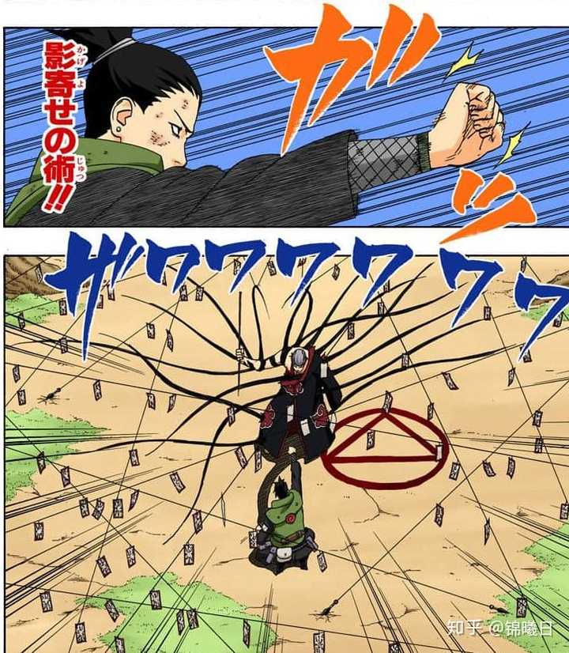
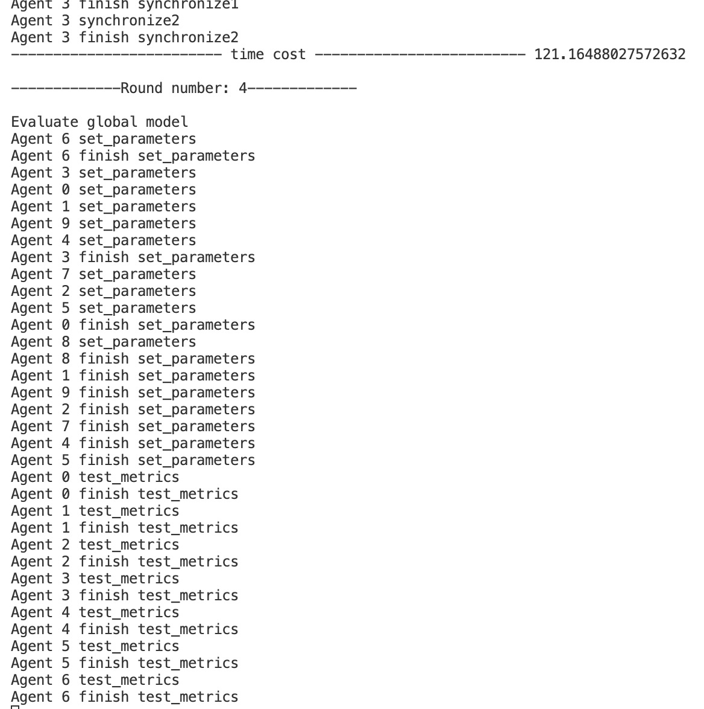

## SHADOW: **S**ynchronize **H**eterogeneous **A**nd **D**istributed Client in Federated Learning Tasks

联邦学习算法的分布式实现，原算法模拟的仓库基于：https://github.com/TsingZ0/PFL-Non-IID

利用python的socket通信实现了SHADOW client 这一概念，即：server对不同设备上的client完全封装，利用集成了socket模块的shadow client进行指令传递和数据收集，可以做到client在多个设备上迁移而server的代码一字不改


SHADOW client 灵感来源于多重影分身之术和影子模仿（束缚）术。意为SHADOW client行为（函数方法）与真实的client完全一致，通过操控SHADOW client完成对其他设备上的client的控制





【运行代码】
目前实现了MNIST 的fedavg算法，运行示例如下：

* 构造数据集
```
cd ./dataset
# python generate_mnist.py iid balance - # for iid and balanced scenario
# python generate_mnist.py noniid - pat # for pathological noniid and unbalanced scenario
# python generate_mnist.py noniid - dir # for practical noniid and unbalanced scenario
```

* 把数据复制到```/system/flcore/physicalclients ```下一份
* server端执行```/system```下的```main.py```,client端执行```/system/flcore/physicalclients```下的```start_clients.py```,命令行参数必须相同，比如：

server：```python main.py -data mnist -m cnn -algo FedAvg -gr 2500 -did 0 -go cnn --num_clients 10```

client:```python start_clients.py -data mnist -m cnn -algo FedAvg -gr 2500 -did 0 -go cnn --num_clients 10```

运行效果：

